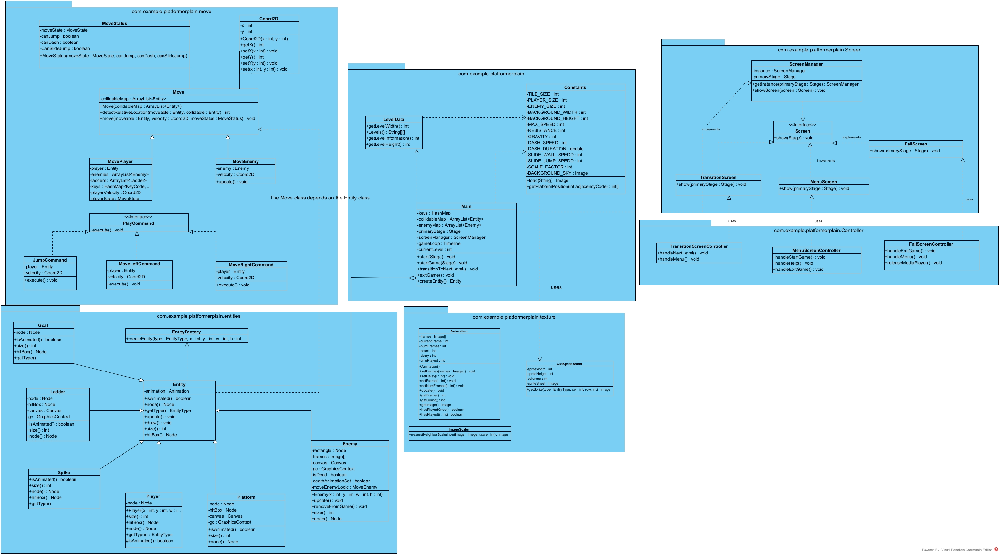

# NGHMP - Next Generation High Mobility Platformer

## Advanced Features

### Momentum-Based Movement System
- The player gets accelerated when the move button is pressed.
- The accelerated speed is reduced when closer to the goal speed, forming a second derivative velocity curve.
- The player can slide and jump on walls.
- The player can dash in 8 directions.

### Auto-Switch Move State System
- Both player and enemy have a `MoveState` that can be automatically switched.
- Different behaviour is applied on each State.

### Multiple Entities
All objects are based on the `Entity` abstract class:

#### Different Types of Moveable Entities
- Enemy
- Player

#### Different Types of Tiles
- Ladder
- Spike
- Goal
- Decoration
- Coin

### Multiple Screens
- Start Screen
- Fail Screen
- Level Choosing Screen
- Pause Screen
- Ranking Screen
- Level Completed Screen

### Sound Effects
- Background music
- Jump Sound
- Dash Sound
- Step Sound

### Textures
- Texture for tiles, player, and enemy.
- Textures can swap between states.
- Textures can have animations.
- Background has moveable textures.

### Others
- Fixed framerate.
- DEBUG mode allows monitoring multiple statuses.


## Demo video

---

## Git Usage
We synchronize all project progress in real time on GitHub following these guidelines:

### 1. Repository Structure

- **Standardized Directory Structure**: Adopt a standardized structural directory for our project to enhance maintainability and readability. Recommended structure includes:
  - `src/` - Source code
  - `tests/` - Test code
  - `docs/` - Documentation
  - `README.md` - Project description

### 2. Commit Messages

- **Clarity and Conciseness**: Accurately describe changes in a brief manner.

### 3. Branch Naming Conventions

- **Descriptive Names:**: Indicate the purpose of the branch.
  
- **Personal Branches**: Each team member works on their own branches to protect the main branch.

### 4. Issue Tracking

- **Utilize GitHub Issues**: Track bugs and feature requests with clear priorities and ownership.

### 5. Version Control

- **Regular Releases**: Regularly release new versions to maintain the project's stability and reliability.

### 7. Regular Cleanup

- **Branch Maintenance**: Archive and delete inactive branches periodically to keep the repository organized.
---

## Refactoring

### JavaFX MVC GUI Design Pattern

- **MVC Pattern**: Separates game logic, UI, and input handling for cleaner code.

- **UI Components**: Multiple FXML screens (Menu, Fail, LevelSelect, Transition, Pause, Complete) enhanced with style.css.

### Object-Oriented Design Pattern

- **Factory Pattern**: Simplifies creation of game entities and tiles via EntityFactory.

- **Command Pattern** : Manages player movements using PlayCommand interface.

- **Interpreter Pattern** : Calculates scores with Expression interface based on time and enemies defeated.

- **Observer Pattern** : Provides real-time updates on player's score and time through GameModelObserver.

- **Singleton Pattern** : Manages screens with a single ScreenManager instance.

- **State Pattern** : Handles player movement states with MoveStateHandler.

---

## Javadocs

Comprehensive documentation for classes, interfaces, and methods is available. Generate Javadocs using:

    ```bash
    javadoc -d ../docs/javadoc -sourcepath . -subpackages com.yourpackage
    ```
   Replace `com.yourpackage` with the appropriate package name of your source files.

### Documentation Standards

The Javadocs include documentation for the following components:

- **Classes**: Descriptions of purpose and functionality.
- **Interfaces**: Details on functionality, parameters, and returns.
- **Methods**: Explanations of important fields.

---

## Class Diagram

Visual representation of main classes and their relationships is available in the Diagram directory as ClassDiagram.jpg or .vpp. Use UML tools for detailed views.

### Class Diagram Display



---


## Appendix

The following open-source assets were used in this project:

- **Dagon's Fantasy All-In-One [16x16]** by Eduardo Scarpato
  - Author: [Eduardo Scarpato](https://eduardscarpato.itch.io/)
  - Source: [https://eduardscarpato.itch.io/dagon](https://eduardscarpato.itch.io/dagon)
  - License: This asset pack can be used in free and commercial projects. You cannot distribute or sell those assets directly (even modified).


- **Samurai 2D Pixel Art** by Mattz Art  
  - Author: [Mattz Art](https://xzany.itch.io/)  
  - Source: [https://xzany.itch.io/samurai-2d-pixel-art](https://xzany.itch.io/samurai-2d-pixel-art)  
  - License: You can use this asset in any game project, personal or commercial. You cannot resell or redistribute it as a standalone game asset; it must be part of a larger project. Credit is not required but appreciated. You may modify the asset to suit your needs. You are not allowed to turn any of the assets into NFTs.  

- **Retro Player 90 Movement SFX** by Leohpaz
  - Author: [Leohpaz](https://leohpaz.itch.io/)
  - Source: [https://leohpaz.itch.io/90-retro-player-movement-sfx](https://leohpaz.itch.io/90-retro-player-movement-sfx)
  - License: Both the demo and the complete pack are free to use in your projects. You may not sell it or distribute this asset pack for free; please redirect people to this page if someone else shows interest in my work. Credits are not mandatory, but much appreciated!

- **将棋駒／Shogi Pieces** by AlisAlia
  - Author: [AlisAlia](https://alisalia.itch.io/)
  - Source: [https://alisalia.itch.io/shogi-pieces](https://alisalia.itch.io/shogi-pieces)
  - License: 個人または商用プロジェクトも自由に使用できます。あなたのゲームに合わせて編集または変更できます。このアセットパックを変更していない状態で再販することはできません。このアセットパックを自分のものとして主張することはできません。不明点がございましたらよりお願いします。

- **m6x11** by Daniel Linssen
  - Author: [Daniel Linssen](https://managore.itch.io/)
  - Source: [https://managore.itch.io/m6x11](https://managore.itch.io/m6x11)
  - License: Free to use with attribution.

- **Hybrid song 2:20 (Funky stars)** 
  - Author: Quazar of Sanxion
  - License: copyright-free.