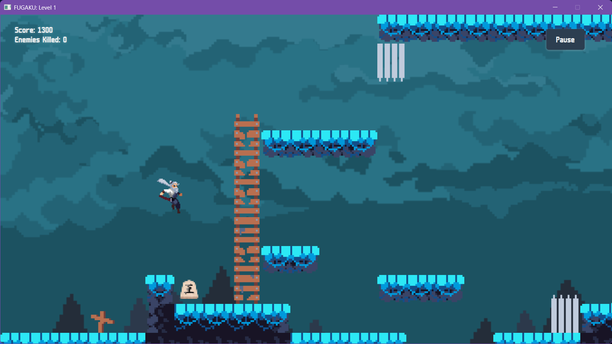
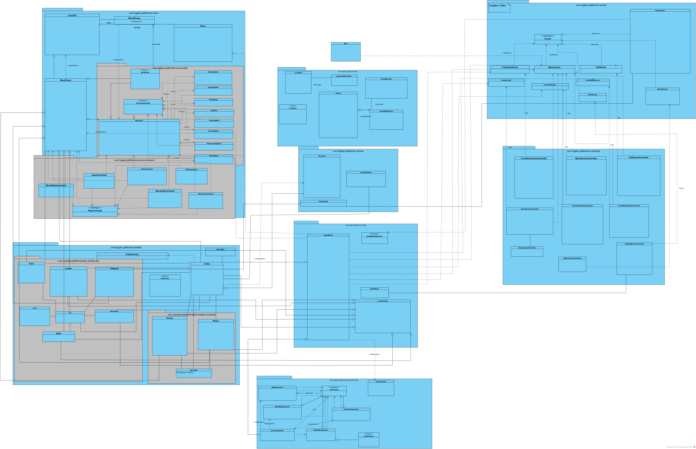

# FUGAKU - the Fast Unprecedented Gripping Arcade Kinetic Unique PLATFORMER

## Advanced Features

### 1. Momentum-Based Movement System

- The player gets accelerated when the move button is pressed.
- The accelerated speed is reduced when closer to the goal speed, forming a second derivative velocity curve.
- The player can slide and jump on walls.
- The player can dash in 8 directions.

#### 1.1 Auto-Switch Move State System

- Both player and enemy have a `MoveState` that can be automatically switched.
- Different behaviour is applied on each State.

### 2. Multiple Entities

All objects are based on the `Entity` abstract class:

#### 2.1 Different Types of Moveable Entities

- Enemy
- Player

#### 2.2 Different Types of Tiles

- Ladder
- Spike
- Goal
- Decoration
- Coin

### 3. Multiple Screens

- Start Screen
- Fail Screen
- Level Choosing Screen
- Pause Screen
- Ranking Screen
- Level Transistion Screen
- Level Completed Screen
- Option Screen

### 4. Sound Effects

- Background music
- Jump Sound
- Dash Sound
- Step Sound

### 5. Textures

- Texture for tiles, player, and enemy.
- Textures can swap between states.
- Textures can have animations.
- Background has textures that can move for perspective effent.

### 6. Others

- Fixed framerate.
- DEBUG mode allows monitoring multiple statuses.
- Consistent and advanced Retro art style.

## Git Usage

We synchronize all project progress in real time on GitHub following these guidelines:

- **Standardized Directory Structure**: Adopt a standardized structural directory for our project to enhance maintainability and readability. Our structure includes:
  - `src/` - Source code
  - `tests/` - Test code
  - `resources/` - Resources

- **Flexible Branch Usage** We feel sorry that we deleted merged branch. Please do check our [repository graph](https://csprojects.nottingham.edu.cn/scycl11/platformer/-/network/main?ref_type=heads) to evaluate our Branch usage.

- **Efficient Issue Tracking**

## Refactoring

### JavaFX MVC GUI Design Pattern

- **MVC Pattern**: Separates game logic, UI, and input handling for cleaner code.

- **UI Components**: Multiple FXML screens (Menu, Fail, LevelSelect, Transition, Pause, Complete) enhanced with style.css.

### Object-Oriented Design Pattern

- **Singleton Pattern** : Manages screens with a single ScreenManager instance.

- **Factory Pattern**: Simplifies creation of game entities and tiles via EntityFactory.

- **Command Pattern** : Manages player movements using PlayCommand interface.

- **Interpreter Pattern** : Calculates scores with Expression interface based on time and enemies defeated.

- **State Pattern** : Handles player movement states with MoveStateHandler.

- **Observer Pattern** : Provides real-time updates on player's score and time through GameModelObserver.

## Javadocs

Our Javadoc is a comprehensive documentation for classes, interfaces, and methods.

- **Classes**: Descriptions of purpose and functionality.
- **Interfaces**: Details on functionality, parameters, and returns.
- **Methods**: Explanations of important fields.

## Class Diagram

Visual representation of main classes and their relationships is available in the Diagram directory.

## Appendix

The following open-source assets were used in this project:

| Asset Title | Author | Source | License |
|--|--|--|----|
| Dagon's Fantasy All-In-One [16x16] | [Eduardo Scarpato](https://eduardscarpato.itch.io/) | [Link](https://eduardscarpato.itch.io/dagon) | This asset pack can be used in free and commercial projects. You cannot distribute or sell those assets directly (even modified). |
| Samurai 2D Pixel Art  | [Mattz Art](https://xzany.itch.io/) | [Link](https://xzany.itch.io/samurai-2d-pixel-art)  | You can use this asset in any game project, personal or commercial. You cannot resell or redistribute it as a standalone game asset; it must be part of a larger project. Credit is not required but appreciated. No NFTs allowed.  |
| Retro Player 90 Movement SFX  | [Leohpaz](https://leohpaz.itch.io/) | [Link](https://leohpaz.itch.io/90-retro-player-movement-sfx) | Both the demo and the complete pack are free to use in your projects. You may not sell it or distribute this asset pack for free; please redirect people to this page if someone else shows interest. Credits are appreciated but not mandatory. |
| 将棋駒／Shogi Pieces  | [AlisAlia](https://alisalia.itch.io/) | [Link](https://alisalia.itch.io/shogi-pieces)    | 個人または商用プロジェクトも自由に使用できます。あなたのゲームに合わせて編集または変更できます。このアセットパックを変更していない状態で再販することはできません。このアセットパックを自分のものとして主張することはできません。不明点がございましたらよりお願いします。 |
| m6x11  | [Daniel Linssen](https://managore.itch.io/) | [Link](https://managore.itch.io/m6x11) | Free to use with attribution.  |
| Hybrid song 2:20 (Funky stars)  | Quazar of Sanxion   | N/A  | copyright-free.  |